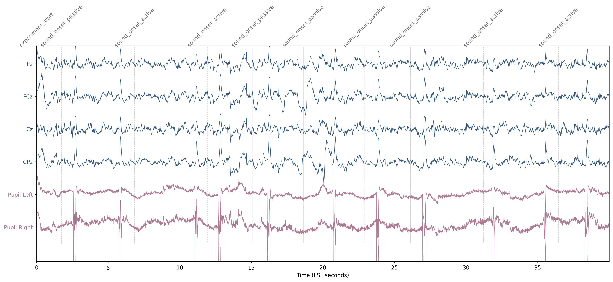

# 🧠 sync-neon-eeg

**A multimodal integration pipeline for high-precision synchronization of EEG and eye-tracking telemetry via Lab Streaming Layer (LSL).**

This project provides a complete workflow for running and analyzing synchronized experiments using Mentalab Explore Pro, Pupil Labs Neon, and PsychoPy.

---

## Overview

The workflow is divided into three main stages: execution, analysis, and visualization.

### 1. Experiment Execution
**File:** `psychopy_script_Mentalab_Neon.py`  
The core PsychoPy script for high-precision data collection.

* **Task Design:** Implements an active/passive trial structure (40 trials each). Participants trigger tones by button presses in "active" mode, while tones play after random delays in "passive" mode.
* **Data Streaming:** Broadcasts task events via LSL as the `PSY_MARKERS_TASK` stream.
* **Device Integration:** Uses the Pupil Labs Neon Real-Time API and Neon-PsychoPy plugin for event synchronization and recording control, alongside Mentalab Explore for EEG data.
* **Synchronization:** Handles PC-to-Neon clock offset estimation to ensure precise temporal alignment of all markers.

### 2. Data Analysis
**File:** `analysis_notebook.ipynb`  
A Jupyter notebook for processing `.xdf` recordings from Lab Recorder.

* **Data Loading:** Uses `pyxdf` to load synchronized EEG, Pupil Diameter, and Task Marker streams.
* **Preprocessing:** Optional frequency filters for the EEG data.
* **MNE Integration:** Generates an `MNE-Python RawArray` containing EEG channels (Fz, FCz, Cz, CPz) and bilateral pupil diameter (Left, Right).
* **Event Annotation:** Converts LSL markers into MNE annotations for trial-based analysis.

### 3. Results Visualization
**File:** `synced_event_plot.png`  
The visual output validating the multi-modal alignment.

* **Unified View:** Displays synchronized EEG and pupil diameter traces on a single high-resolution timeline.
* **Event Mapping:** Features vertical dashed markers and labels (e.g., `sound_onset_active`) aligned with physiological signals to verify temporal accuracy.

---

## Example Output

*Figure 1: Multimodal visualization showing the first few seconds of an experiment with synchronized EEG, pupil diameter, and PsychoPy task markers.*

---

## Requirements

* **Python 3.8+**
* `mne`
* `pyxdf`
* `psychopy`
* `numpy`
* `scipy`
* `matplotlib`

---

## Usage

1.  **Record:** Run `psychopy_script_Mentalab_Neon.py` while Lab Recorder is active.
2.  **Process:** Open `analysis_notebook.ipynb` and point the data path to your recorded `.xdf` file.
3.  **Visualize:** Generate and save your synchronized multi-modal plots.

---
